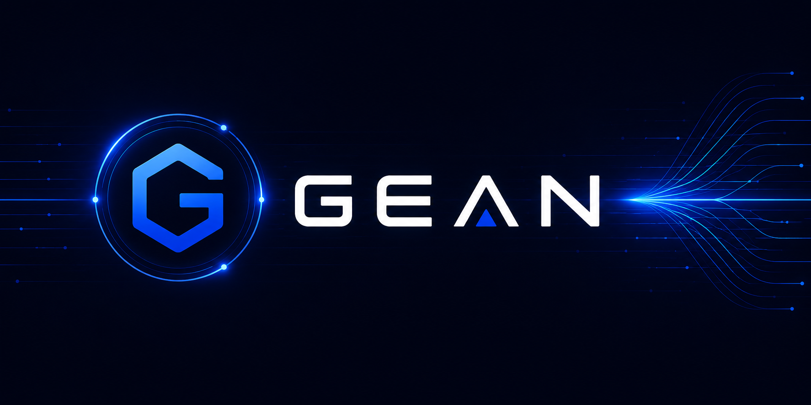

# Gean: Lean Ethereum consensus client

An open-source Lean Ethereum consensus client, written in Go and maintained by Gean Labs.



## Overview

Gean is:

- A consensus client for [Lean Ethereum](https://github.com/leanEthereum), designed for fast finality, quantum-resistant security, and a simpler core protocol.
- Implementing Lean Consensus devnet-5 alongside independent client implementations.
- Built for clarity and auditability, with a deliberately small codebase.
- Quantum-resistant by design, using XMSS signatures instead of BLS signatures.

## Getting started

### Prerequisites

- [Go](https://go.dev/doc/install) 1.25+
- [Rust](https://www.rust-lang.org/tools/install) 1.92.0
- [uv](https://docs.astral.sh/uv/)
- [Docker](https://www.docker.com/get-started/)

### Building and testing

```sh
make build       # Build the Rust FFI and Go binaries
make test        # Run Go unit tests
make test-ffi    # Run XMSS FFI tests
make test-spec   # Generate and run production-scheme consensus fixtures
make lint        # Run Go and Rust linters
make docker-build
```

Run `make help` for all available targets.

### Running locally

For a multi-client devnet:

```sh
make run-devnet
```

For a three-node Gean network, run the setup once and start each node in a separate terminal:

```sh
make run-setup
make run
make run-node1
make run-node2
```

At least one node must run as an aggregator for the network to finalize.

## Current status

Gean tracks Lean Consensus devnet-5. Consensus fixtures are generated from
`leanSpec@fd7dfd0e85bd83d43e0a6b1bc2bfafb1ea3049d5` with
leanVM/leanMultisig `8fcbd77958a58666e828315de2d6ce7c93297117`.

## Philosophy

Gean treats reviewability as a consensus-safety property. Consensus-critical behavior should remain small enough to audit end to end, and disagreements between clients should be traceable to a small number of files.

## License

Gean is open-source software released under the MIT license.
